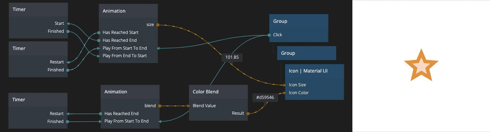

# noodl-material-icons
*Material UI Icons module for Noodl*

This module adds the node "Icon | Material UI" that expose the Material UI icon font in Noodl as a simple to use node. It also sets up the project with a link to stylesheets for all styles of the material icon font. Every Icon node adds only a span-tag which makes it easy to use these nodes together with text nodes. 

## Two-Tone style
Two-tone style does not work with the color css property so behind the scenes the color choosen is instead translated into a css filter. This is not visible in Noodl, rather the user selects the color they want and do not need to care about if it is Two-tone styled or not.

## Removing unused icon styles 
If you want to remove unused icon font styles (for example you have slow load times in your application) you would go into to [your project folder]/noodl_modules/mui-icons-module/manifest.json and modify the link tag's href attribute. Default href calls css?family=Material+Icons|Material+Icons+Outlined|Material+Icons+Two+Tone|Material+Icons+Round|Material+Icons+Sharp. You can remove the unused fonts here and those won't download anymore on app start.

